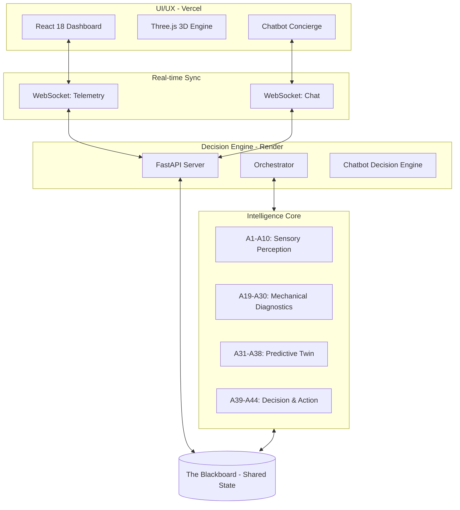
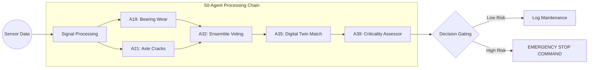

# 🚅 RailGuard 5000: The Multi-Agent Decision Engine

**Live Platform:** [https://multiagent-platform.vercel.app/](https://multiagent-platform.vercel.app/)  
**Live API (Render):** [https://multiagent-backend-fm5f.onrender.com/](https://multiagent-backend-fm5f.onrender.com/)

---

## 🛑 The Problem: The "Silent Failure" of Infrastructure

Modern high-speed rail systems generate **terabytes of data per second**. Human operators and traditional "if-then" software fail in two critical ways:
1.  **Context Blindness**: An alarm for a "0.2mm axle crack" might be routine on flat ground but **catastrophic** 2km before a high-speed tunnel entry.
2.  **Information Overload**: Operators are bombarded with 100+ "nominal" alerts, causing them to miss the one "Rare Event" (Black Swan) that leads to derailment.

### The Problem Statement
"How can we transition from reactive maintenance (fixing things after they break) to predictive intelligence that can synthesize conflicting data from 50 different sensors to make life-or-death decisions in under 10 seconds?"

---

## 🏗️ System Architecture & Tech Stack

The architecture follows a **Blackboard Pattern**, where 50 autonomous agents observe a shared state and contribute expertise.

### Why these technologies?
-   **Three.js**: Essential for visualizing complex physics (cracks, vibration FFTs) in a 3D space that intuitive for engineers.
-   **FastAPI + WebSockets**: Provides the massive concurrency needed to handle 50 agents writing to the blackboard simultaneously without lag.
-   **Framer Motion**: Used in the Concierge UI to handle high-density data updates with smooth micro-animations.

---

## 🧠 The Solution: Distributed Intelligence

Instead of one massive AI model (which is slow and halluncinates), RailGuard 5000 uses **50 Narrow-AI Agents**.

### Why 50 Agents?
-   **Resilience**: If 10 agents go offline (e.g., in a tunnel), the remaining 40 re-prioritize bandwidth to maintain safety (A47 Bandwidth Allocator).
-   **Triple-Gate Validation**: No alert reaches the driver unless A32 (Ensemble), A33 (Uncertainty), and A37 (History) verify the anomaly.

---

## 🤖 The RailGuard Agent Roster (50 Specialized AI)

| ID | Category | Function | Why it's useful |
|:---|:---|:---|:---|
| **A1-A10** | **Sensors** | Vision, Thermal, Acoustic, Vibration | Collects raw "physical" truth from the tracks. |
| **A11-A18** | **Processing** | Deblurring, Zoom, Noise Filtering | Cleans data for high-speed (300km/h) environments. |
| **A19-A30** | **Diagnostics** | Axle, Wheel, Brake, Suspension | Detects specific structural failures before they happen. |
| **A31-A38** | **Cognition** | Simulations, What-If, Meta-Learning | Predicts future failure timelines using Digital Twins. |
| **A39-A44** | **Action** | Priority, Planning, Voice Alerts | Translates raw data into commands (e.g., "STOP NOW"). |
| **A45-A50** | **Network** | Bandwidth, Mesh, Offline Sync | Ensures data reaches the cloud even in tunnels (A46). |

---

## 🌍 Real-Life Examples & Utility

### Scenario A: The "Perfect Storm"
**Conditions:** 840 passengers, tunnel entry in 2.3km.  
**Discovery:** A21 finds a growth rate of 0.19mm.  
**Decision:** A36 simulates a 92% derailment risk inside the tunnel. A39 issues an **IMMEDIATE STOP**, stopping the train 200m before the portal.

### Scenario B: The $500k Budget Triage
**Condition:** Management has limited CAPEX.  
**Decision:** A39/A40 identifies "Fleet C" on coastal routes is 3x more likely to fail than "Fleet A." It allocates $300k to Fleet C, maximizing safety ROI per dollar spent.

---

## � Deployment & Integrity
The system uses **RailGuard Engine v8.2**, featuring a **Stateless Reasoning Core** that completely eliminates context-drift (broken record responses). Every query is a fresh synthesis of the current blackboard state.

---
*Developed for the future of Intelligent Infrastructure.*
